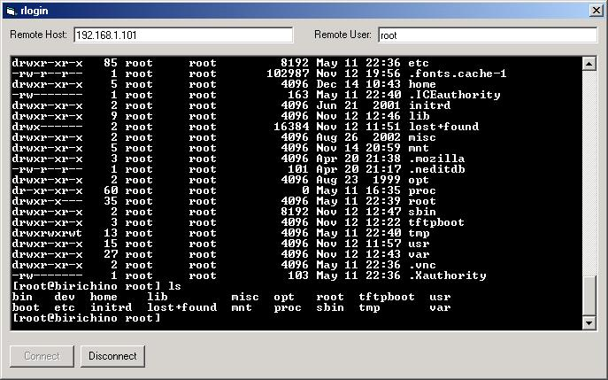



## rlogin client

### Description

Forget telnet... connect to remote Unix, Linux, VMS, and Windows hosts with the rlogin protocol. This code is _heavily_ commented for learning basic socket programming, and for using the WinSock control. This is a FULLY FUNCTIONAL client.
 
### More Info
 

             |
---                |---
**Submitted On**   |2003-05-12 21:52:08
**By**             |[R\.G\. Brown](https://github.com/Planet-Source-Code/PSCIndex/blob/master/ByAuthor/r-g-brown.md)
**Level**          |Intermediate
**User Rating**    |5.0 (25 globes from 5 users)
**Compatibility**  |VB 5\.0, VB 6\.0
**Category**       |[Internet/ HTML](https://github.com/Planet-Source-Code/PSCIndex/blob/master/ByCategory/internet-html__1-34.md)
**World**          |[Visual Basic](https://github.com/Planet-Source-Code/PSCIndex/blob/master/ByWorld/visual-basic.md)
**Archive File**   |[rlogin\_cli1586935122003\.zip](https://github.com/Planet-Source-Code/r-g-brown-rlogin-client__1-45425/archive/master.zip)

### API Declarations

GetUserName

